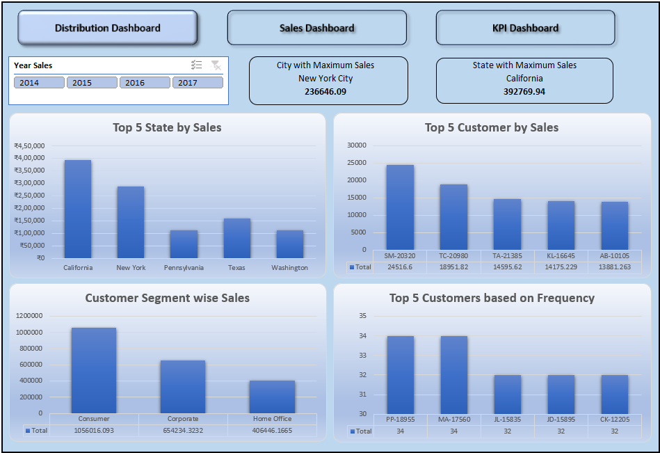
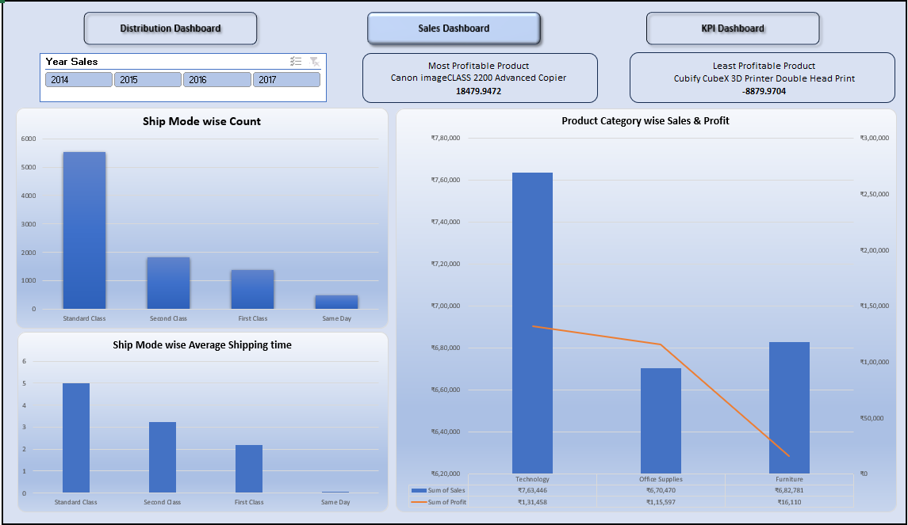
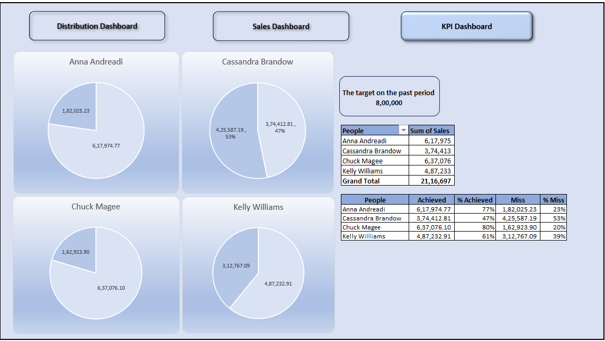

# 📊 Excel Sales Analysis Dashboard

## 📌 Project Overview

This project is an interactive Excel dashboard developed to analyze sales performance and provide business insights using Pivot Tables, Pivot Charts, Slicers, and KPIs.

---

## 🎯 Objectives

- Analyze sales trends
- Track KPIs
- Identify top-performing products
- Monitor regional sales
- Improve business decision-making

---

## 🛠 Tools Used

- Microsoft Excel
- Pivot Tables
- Pivot Charts
- Slicers
- Conditional Formatting

---

## 📷 Dashboard Preview

### Distribution Dashboard



### Sales Dashboard



### KPI Dashboard



---

## 📊 Key Features

- Interactive Dashboard
- Dynamic Filters
- Sales KPIs
- Regional Analysis
- Product Performance
- Customer Insights

---

## 📁 Folder Structure

```text
01-Excel-Sales-Analysis-Dashboard
│
├── README.md
├── LICENSE
├── Sales Analysis Dashboard.xlsx
│
├── Dataset
│   └── Sales Dataset.xlsx
│
└── Images
    ├── Dashboard1.png
    ├── Dashboard2.png
    └── Dashboard3.png

```

---

## 👨‍💻 Author

**Shivam Choudhry**
